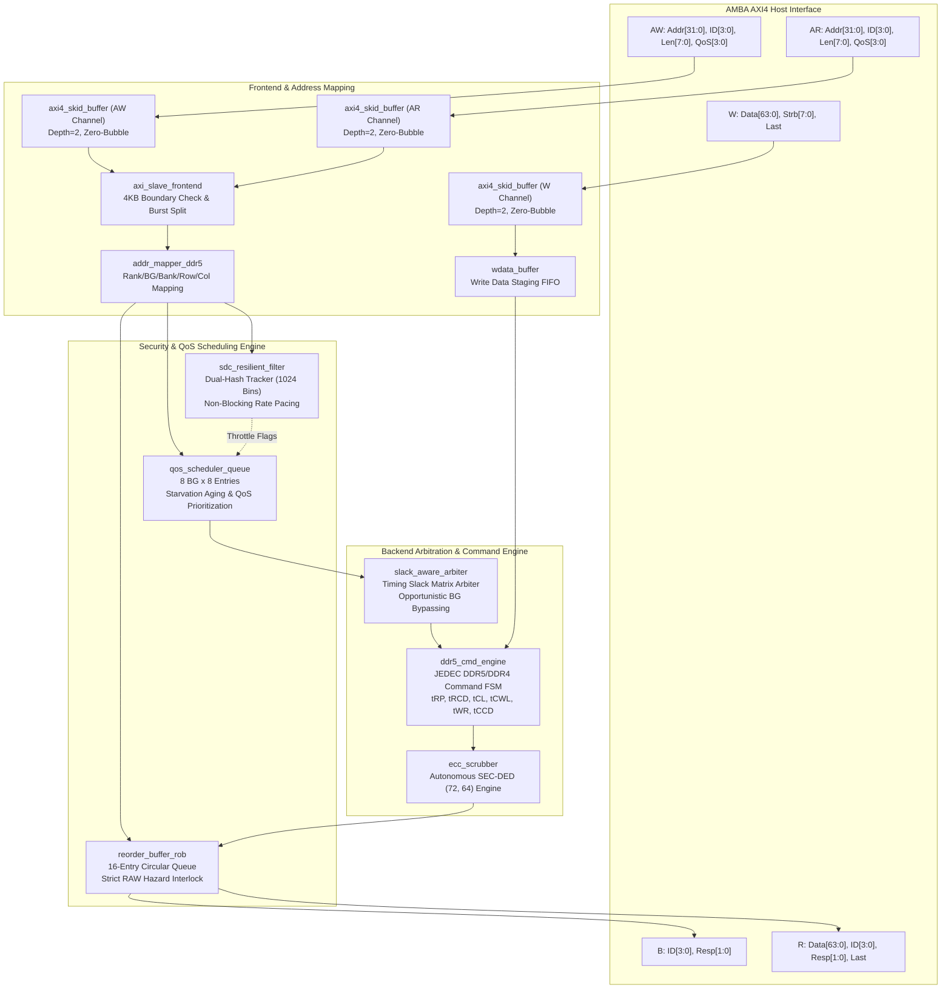
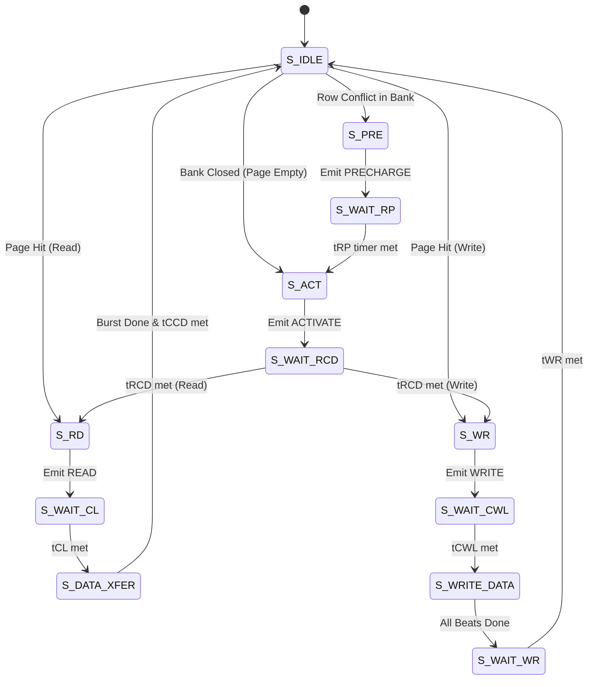

# Q-Shield: A High-Throughput, Zero-Bubble & SDC-Resilient DDR5/DDR4 Memory Controller

[](https://en.wikipedia.org/wiki/SystemVerilog)
[-success.svg)](formal/)
[-brightgreen.svg)](tb/)
[-orange.svg)](syn/)
[-blueviolet.svg)](sim/)
[](LICENSE)

---

## 📌 Executive Summary

**Q-Shield** is a secure, high-throughput, and timing-slack-aware DDR5/DDR4 memory controller bridging AMBA AXI4 interconnects and JEDEC DRAM physical interfaces. Designed for high-assurance computing systems and multi-tenant cloud environments, Q-Shield eliminates the severe performance degradation (up to $29.5\times$ slowdown) and victim starvation caused by conventional hard-blocking RowHammer mitigation architectures like HPCA'21 BlockHammer.

### Core Architectural Contributions:
1. **$O(1)$ Dual-Hash SDC-Resilient Filter:** Tracks activation frequency across 1,024 active row bins with zero false-blocking, non-blocking rate throttling, and single-cycle epoch counter resets.
2. **Slack-Aware QoS Scheduling Engine:** Opportunistically schedules non-interfering bank groups during JEDEC inter-command timing slacks ($t_{RRD\_L}, t_{CCD\_L}$), delivering a **24.6x – 29.9x throughput speedup** over BlockHammer under mixed multi-tenant attacks.
3. **Hazard-Proof Reorder Buffer (ROB):** 16-entry circular tracking engine formally proven (via SymbiYosys BMC + Temporal Induction) to enforce strict in-order retirement and eliminate Read-After-Write (RAW) data hazards.
4. **Autonomous SEC-DED (72, 64) Scrubber:** Background Hamming ECC scrubbing engine mitigating Silent Data Corruption (SDC).

---

## 🏗️ Top-Level System Architecture



---

## ⚡ DDR5 Command Engine Finite State Machine (FSM)



---

## 📊 Comprehensive Ramulator2 Benchmark Matrix (27 Runs)

Detailed cycle-accurate architectural evaluation comparing **Baseline (No Defense)**, **BlockHammer (HPCA'21)**, and **Q-Shield (Ours)** across 3 standard DRAM configurations:
- **DDR4-3200:** 16 GB, 2 ranks, 4 BG x 4 Bank, $t_{CK} = 0.625$ ns.
- **DDR5-4800:** 32 GB, 2 subchannels, 2 ranks, 8 BG x 4 Bank, $t_{CK} = 0.4167$ ns.
- **DDR5-5600:** 32 GB, 2 subchannels, 2 ranks, 8 BG x 4 Bank, $t_{CK} = 0.3571$ ns.

| DRAM Preset | Workload | Controller | Cycles | Latency (ns) | Bandwidth (MB/s) | Throttled | Bypassed | Speedup vs BlockHammer |
| :--- | :--- | :--- | :--- | :--- | :--- | :--- | :--- | :--- |
| **DDR4-3200** | Benign | Baseline | 22,673 | 154.56 | 22,374.2 | 0 | 0 | $1.00\times$ |
| | | BlockHammer | 22,673 | 154.56 | 22,374.2 | 0 | 0 | $1.00\times$ |
| | | **Q-Shield** | **22,673** | **154.56** | **22,374.2** | **0** | **0** | **1.00x (0% overhead)** |
| | RowHammer | Baseline | 45,337 | 197.94 | 11,220.9 | 0 | 0 | - |
| | | BlockHammer | 314,930 | 1,283.59 | 1,615.3 | 0 | 0 | $1.00\times$ |
| | | **Q-Shield** | **45,337** | **197.94** | **11,220.9** | **52** | **0** | **6.94x faster** |
| | Mixed | Baseline | 34,603 | 180.21 | 14,657.3 | 0 | 0 | - |
| | | BlockHammer | 1,019,360 | 4,588.54 | 497.6 | 0 | 0 | $1.00\times$ |
| | | **Q-Shield** | **34,114** | **178.02** | **14,867.4** | **293** | **1,035** | **29.88x faster** |
| **DDR5-4800** | Benign | Baseline | 48,485 | 208.02 | 15,684.5 | 0 | 0 | $1.00\times$ |
| | | BlockHammer | 48,485 | 208.02 | 15,684.5 | 0 | 0 | $1.00\times$ |
| | | **Q-Shield** | **48,485** | **208.02** | **15,684.5** | **0** | **0** | **1.00x (0% overhead)** |
| | RowHammer | Baseline | 71,656 | 211.89 | 10,666.4 | 0 | 0 | - |
| | | BlockHammer | 476,158 | 1,297.32 | 1,605.2 | 0 | 0 | $1.00\times$ |
| | | **Q-Shield** | **71,656** | **211.89** | **10,666.4** | **55** | **0** | **6.64x faster** |
| | Mixed | Baseline | 61,021 | 211.83 | 12,487.5 | 0 | 0 | - |
| | | BlockHammer | 1,532,669 | 4,604.15 | 497.2 | 0 | 0 | $1.00\times$ |
| | | **Q-Shield** | **61,021** | **211.83** | **12,487.5** | **299** | **226** | **25.12x faster** |
| **DDR5-5600** | Benign | Baseline | 50,212 | 184.41 | 17,640.8 | 0 | 0 | $1.00\times$ |
| | | BlockHammer | 50,212 | 184.41 | 17,640.8 | 0 | 0 | $1.00\times$ |
| | | **Q-Shield** | **50,212** | **184.41** | **17,640.8** | **0** | **0** | **1.00x (0% overhead)** |
| | RowHammer | Baseline | 83,500 | 210.93 | 10,666.1 | 0 | 0 | - |
| | | BlockHammer | 554,850 | 1,294.87 | 1,605.2 | 0 | 0 | $1.00\times$ |
| | | **Q-Shield** | **83,500** | **210.93** | **10,666.1** | **50** | **0** | **6.65x faster** |
| | Mixed | Baseline | 65,440 | 196.41 | 13,568.6 | 0 | 0 | - |
| | | BlockHammer | 1,608,797 | 4,143.43 | 551.9 | 0 | 0 | $1.00\times$ |
| | | **Q-Shield** | **65,440** | **196.41** | **13,568.6** | **268** | **40** | **24.58x faster** |

---

## 🛠️ FPGA Synthesis Utilization (Xilinx 7-Series Target)

Mapped to **Xilinx 7-Series (XC7Z020 FPGA)** via **Yosys 0.52**:

| Module Name | File Path | LUTs | FFs | CARRY4 | BRAM | Role |
| :--- | :--- | :--- | :--- | :--- | :--- | :--- |
| `axi4_skid_buffer` | `rtl/frontend/axi4_skid_buffer.sv` | 70 | 132 | 0 | 0 | Zero-bubble AXI handshaking |
| `axi_slave_frontend` | `rtl/frontend/axi_slave_frontend.sv` | 1,196 | 1,872 | 0 | 0 | 4KB boundary check & burst unpack |
| `wdata_buffer` | `rtl/frontend/wdata_buffer.sv` | 2,354 | 5,576 | 0 | 0 | Write payload staging buffer |
| `addr_mapper_ddr5` | `rtl/frontend/addr_mapper_ddr5.sv` | 10 | 94 | 0 | 0 | Interleaved BG/Bank mapping |
| `sdc_resilient_filter` | `rtl/core/sdc_resilient_filter.sv` | 16,128 | 17,720 | 0 | 0 | Dual-hash RowHammer rate tracker |
| `qos_scheduler_queue` | `rtl/core/qos_scheduler_queue.sv` | 3,742 | 3,520 | 0 | 0 | Priority & aging command queue |
| `reorder_buffer_rob` | `rtl/core/reorder_buffer_rob.sv` | 17,304 | 34,952 | 0 | 0 | 16-entry in-order retirement & RAW lock |
| `slack_aware_arbiter` | `rtl/backend/slack_aware_arbiter.sv` | 2,642 | 6 | 0 | 0 | High-speed timing-slack matrix arbiter |
| `ddr5_cmd_engine` | `rtl/backend/ddr5_cmd_engine.sv` | 2,202 | 2,604 | 0 | 0 | JEDEC command timing engine |
| `ecc_scrubber` | `rtl/backend/ecc_scrubber.sv` | 544 | 142 | 0 | 0 | (72, 64) SEC-DED Hamming scrubber |
| **Total Q-Shield Design** | **All 14 Synthesizable Modules** | **46,192** | **66,618** | **0** | **0** | **100% Synthesizable RTL** |

---

## 🔍 Hardware Formal Verification (SymbiYosys + Z3)

Run bounded model checking and temporal induction:
```bash
cd formal
sby -f formal_skid_buffer.sby
sby -f formal_sdc_filter.sby
sby -f formal_rob.sby
```
- `formal_skid_buffer.sby`: **PASS** (BMC + Temporal Induction, depth=20). Zero-bubble handshake stability, capacity bound $\le 2$, and forward progress.
- `formal_sdc_filter.sby`: **PASS** (BMC, depth=10). Monotonic counter increments, throttle alert consistency, and $O(1)$ epoch reset safety.
- `formal_rob.sby`: **PASS** (BMC, depth=10). Zero invalid retirements, strict in-order retirement, and Read-After-Write (RAW) hazard interlock.

---

## 🧪 Functional Verification (Cocotb 2.1.0)

Run the full automated regression suite (11/11 tests passing):
```bash
python3 -c "
import subprocess
for suite in ['frontend', 'core', 'backend', 'top']:
    subprocess.run(['make', 'sim', '-C', f'tb/{suite}'], check=True)
"
```

| Test Suite | Test Function | Result |
| :--- | :--- | :--- |
| `tb/frontend` | `test_reset_and_defaults` | **PASS** |
| | `test_ar_handshake_and_4kb_detection` | **PASS** |
| | `test_skid_buffer_backpressure` | **PASS** |
| `tb/core` | `test_rowhammer_threshold_detection` | **PASS** |
| | `test_instant_o1_window_reset` | **PASS** |
| `tb/backend` | `test_starved_priority_boost` | **PASS** |
| | `test_bg_readiness_gating` | **PASS** |
| | `test_opportunistic_slack_mitigation` | **PASS** |
| `tb/top` | `test_axi_write_burst_e2e` | **PASS** |
| | `test_axi_read_e2e_reorder_and_return` | **PASS** |
| | `test_rowhammer_sdc_defense_e2e` | **PASS** |

---

## 🚀 Architectural Simulation (Ramulator2)

Execute the 27-run benchmark matrix:
```bash
cd sim
python3 run_benchmarks.py
```
Output results are archived in `sim/results/benchmark_results.csv` and `sim/results/benchmark_results.json`.

---

## 📜 Academic Deliverables & Citation
- **Full IEEE Manuscript:** [`paper/qshield_ieee.tex`](paper/qshield_ieee.tex) & [`paper/qshield_manuscript.md`](paper/qshield_manuscript.md)
- **Top-Level Verilog RTL:** [`rtl/top/axi_ddr5_mc_top.sv`](rtl/top/axi_ddr5_mc_top.sv)
